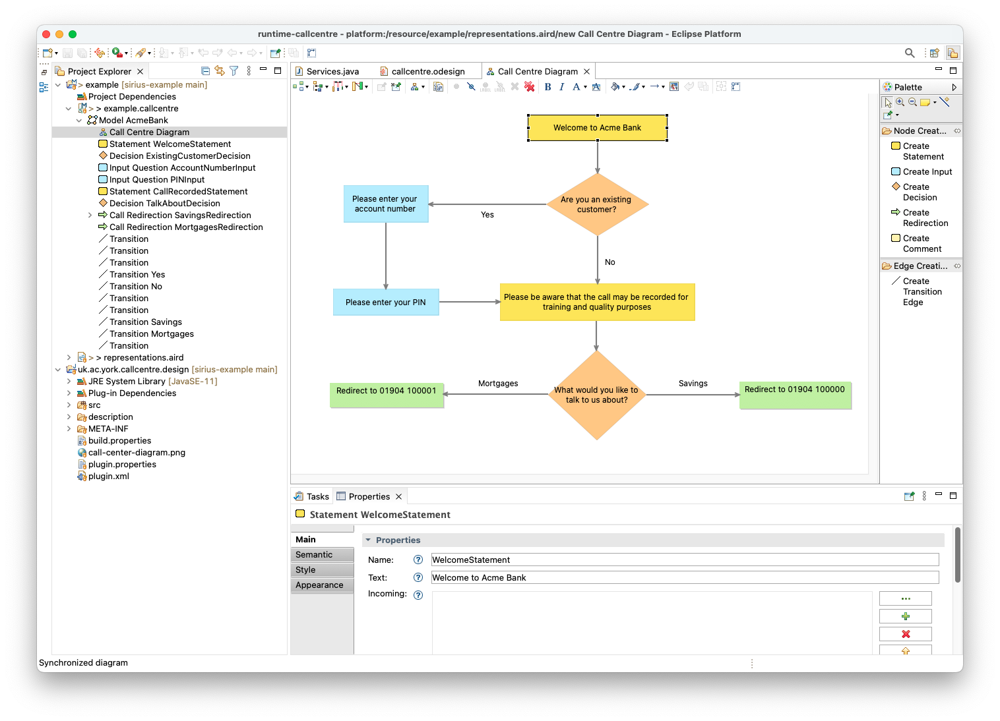

# Call Centre DSL

This is an example graphical model editor with [Eclipse Sirius](https://eclipse.dev/sirius/), for a metamodel that describes automated call centre flows.

## Running the example

1. Create a new Eclipse workspace: we'll call this the *main* workspace.
1. Import the following projects in the workspace.
   1. `uk.ac.york.callcentre`
   1. `uk.ac.york.callcentre.edit`
   1. `uk.ac.york.callcentre.editor`
   1. `uk.ac.york.callcentre.validation`
   1. `uk.ac.york.callcentre.design`
1. Right-click on `uk.ac.york.callcentre` and select "Run as - Eclipse application": this will launch a *nested* Eclipse workspace.
1. Import the following projects into the nested workspace:
   1. `uk.ac.york.callcentre.m2t`
   1. `acmebank.model`
   1. `acmebank.application`
1. Switch to the "Modeling" perspective, and open one of the diagrams within the `acmebank.callcentre` model in the `acmebank.model` project.

## Changing the notation

To experiment with the notation:

1. In the main workspace, change the `.odesign` file as desired, and save your changes to disk.
1. In the nested workspace, click on the "Reload Installed VSMs" button in the main toolbar (highlighted below in red): the diagrams will automatically update themselves.

## Generating code from the model

The `uk.ac.york.callcentre.m2t` project includes example EVL and EGL programs to validate `.callcentre` models and generate sample Java code that implements the workflow as a command-line application.

To run these programs, ensure you have [Epsilon](https://eclipse.dev/epsilon/) installed, and then use one of the launch configurations provided in that project:

* `Launch EVL validation.launch` will check the internal consistency of the `acmebank.callcentre` model, and show any validation errors in a new "Validation" view within Eclipse.
* `Launch EGX code generation.launch` will produce code within the `src-gen` folder of the `acmebank.application` project.